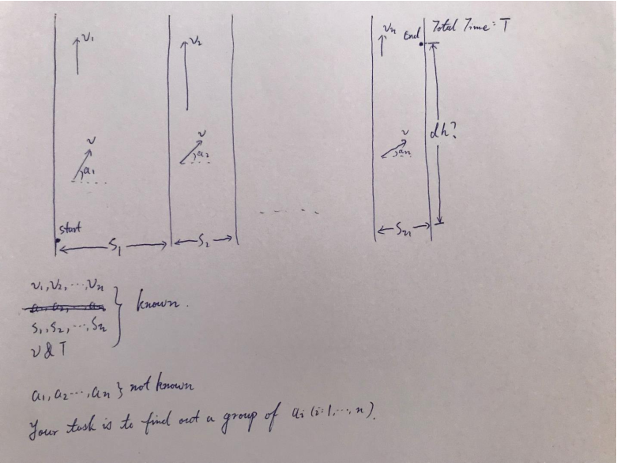

# 题目描述
A person is swimming across several rivers. 
Speeds of those rivers are different: $v_1, v_2, …, v_n$. To simplify this problem, we only consider the speed in vertical direction.

The person's speed is $v$. It's a constant, no way to change that. And the angle of the person's velocity to horizontal line is $a_1, a_2, …, a_n$.

The total time for swimming is $T$. And the person must pass those rivers.

Your task is:
Find out an equation to determine by choosing what angles $(a_1, a_2, …, a_n)$ the person can get maximum distance in vertical direction (That is to say, please maximize dh by determining $a_1, a_2, …, a_n$) under the total time $T$. (You are not required to give out concrete angle numbers, a "cost function" that can be derived from is enough)

Tips:
For this question, a mathematical tool you may need is called "Lagrangian Multiplier". Which means, when you provide a formula, say $E$, which still need to satisfy some more conditions, say $a > 1$, for the convenience of calculating, we can write those 2 parts (formula $E$ and condition $a > 1$) together as one new formula. Here the new formula will be:$ E – \lambda(a - 1)$.

参考资料：

[拉格朗日乘数-维基百科](https://zh.wikipedia.org/wiki/%E6%8B%89%E6%A0%BC%E6%9C%97%E6%97%A5%E4%B9%98%E6%95%B0)

[Lagrange multipliers with visualizations and code](https://towardsdatascience.com/lagrange-multipliers-with-pictures-and-code-ace8018dac5e)

[Is there anyone to help me for Lagrange multipliers method?](https://ww2.mathworks.cn/matlabcentral/answers/436044-is-there-anyone-to-help-me-for-lagrange-multipliers-method)

# 分析
在数学中的最优化问题中，拉格朗日乘数法是一种寻找多元函数在其变量受到一个或多个条件的约束时的极值的方法。这种方法可以将一个有n个变量与k个约束条件的最优化问题转换为一个解有n + k个变量的方程组的解的问题。这种方法中引入了一个或一组新的未知数，即拉格朗日乘数，又称拉格朗日乘子，或拉氏乘子，它们是在转换后的方程，即约束方程中作为梯度（gradient）的线性组合中各个向量的系数。

本题中，我们已知：

河水流速$V_{water}={v_1, v_2,..., v_n}$

河宽$S={s_1, s_2,..., s_n}$

人游泳速度$V$

游过所有河总用时$T$

未知:

人在每条河中游的角度$\alpha={\alpha_1, \alpha_2,...,\alpha_n}$

要使得人在游过所有河时竖直方向上前进的距离$dh$最大。

我们可以列出下面式子：

$$
\begin{split}
g(\alpha) &= T \\
&= \sum_i^n\frac{S_i}{V \times cos(\alpha_i)}= \sum(\frac{S}{V}\frac{1}{cos(\alpha)})
\end{split}\tag{1}
$$
$$
\begin{split}
dh=f(\alpha) &= \sum_i^n[(V_{water_i}+V \times sin(\alpha_i)) \times g(\alpha_i)] \\
&= \sum_i^n [(V_{water_i}+V \times sin(\alpha_i))\times \frac{S_i}{V \times cos(\alpha_i)}] \\
&= \sum[(V_{water}+V \times sin(\alpha))\times \frac{S}{V cos(\alpha)}] \\
&= \sum[\frac{V_{water}S}{V}\frac{1}{ cos(\alpha)}+S\frac{sin(\alpha)}{cos(\alpha)}]
\end{split}\tag{2}
$$

要求 $ f(\alpha)$,在 $g(\alpha)=T$时的最大值时，我们可以引入新变量拉格朗日乘数 $\lambda$ ，这时我们只需要求下列拉格朗日函数的极值即可：
$$
\begin{split}
F(\alpha, \lambda) &= f(\alpha) + \lambda*(g(\alpha)-T) \\
&= \sum[\frac{V_{water}S}{V}\frac{1}{ cos(\alpha)}+S\frac{sin(\alpha)}{cos(\alpha)} + \lambda*(\sum(\frac{S}{V}\frac{1}{cos(\alpha)})-T)]
\end{split}\tag{3}
$$
这意味着$f$ 和$g$ 的切线在某点上平行，同时也意味着两者的梯度向量有如下关系:
$$
\nabla f(\alpha)= -\nabla \lambda(g(\alpha)-T)\tag{4} 
$$
即：
$$
\nabla F(\alpha, \lambda)=\nabla [f(\alpha)+\lambda*(g(\alpha)-T)]= 0 \tag{5} 
$$
一旦求出 $\lambda$ 的值，将其代入公式$(3)$，易求在无约束条件下的极值和对应的极值点。新方程 $ F(\alpha, \lambda)$在达到极值时与 $f(\alpha)$相等，因为 $ F(\alpha, \lambda)$达到极值时 $g(\alpha)-T$总等于零。将所有$F(\alpha, \lambda)$ 方程的偏微分设为零，得到一个方程组，最小值是以下方程组的解中的一个：

$$
\begin{split}
\frac{\partial F}{\partial \alpha} &= \frac{V_{water}S}{V}\frac{\sin(\alpha)}{ \cos(\alpha)}+S\frac{1}{ \cos^2(\alpha)}+\lambda*\frac{S}{V}\frac{\sin(\alpha)}{cos(\alpha)} \\
&=S[\frac{V_{water}+\lambda}{V}*\frac{\sin(\alpha)}{ \cos(\alpha)}+ \frac{1}{ \cos^2(\alpha)}]= 0
\end{split}\tag{6}
$$

$$
\frac{\partial F}{\partial \lambda}= \frac{S}{V}\frac{1}{cos(\alpha)})-T=0\tag{7}
$$

# 计算
由公式$(7)$可得：
$$\cos(\alpha)=\frac{S}{TV}\tag{8}$$
将其带入$(6)$中初步化简得：
$$
T(V_{water}+\lambda)*\sin(\alpha)+\frac{T^2V^2}{S}=0\tag{9}
$$
T不为0故可划去，得：
$$
(V_{water}+\lambda)*\sin(\alpha)+\frac{TV^2}{S}=0\tag{10}
$$
$$
\lambda=-\frac{TV^2+SV_{water}\sin(\alpha)}{S\sin(\alpha)}\tag{11}
$$